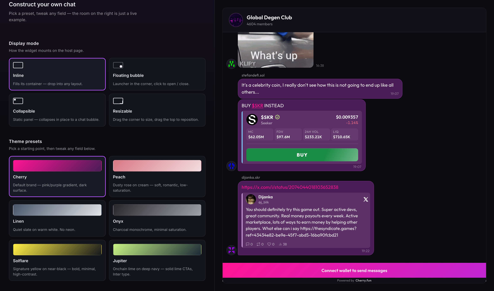

# @cherrydotfun/chat-embed-sdk

Embed Cherry Chat rooms into any website: a lightweight iframe widget with wallet-based auth, full theming, and real-time messaging. Works with any bundler or straight from a `<script>` tag.

## Live demo

Try it: **[cherry.fun/chat-embed-example](https://cherry.fun/chat-embed-example/)** — theme presets, display modes (inline / floating / collapsible / resizable), and a live theme editor, all embedded into a real Cherry chat room. Its "Show the integration snippet" button gives you copy-paste code.



Full documentation lives at **[portal.cherry.fun/docs](https://portal.cherry.fun/docs)**.

## Install

```bash
npm install @cherrydotfun/chat-embed-sdk
```

Or, for a plain HTML site, load the package from npm via jsDelivr (the bundle exposes `window.CherryEmbedSDK`):

```html
<script src="https://cdn.jsdelivr.net/npm/@cherrydotfun/chat-embed-sdk@0.1.5/dist/index.global.js"></script>
```

## Before you start

You need a Cherry **embed**, created self-serve at [portal.cherry.fun](https://portal.cherry.fun):

1. Sign in with your Solana wallet (SIWS — no email/password, nothing goes onchain).
2. Create a **Project**, then open **Chat embeds** → **New embed**.
3. Copy the **embed ID** (your `appId`), add your site's origin under **Allowed origins**, and make sure the embed is **enabled**.

An embed only loads on allow-listed origins while enabled — add `http://localhost:3000` (or your dev origin) before testing locally.

## Quickstart (no backend)

The default **wallet-only** mode needs nothing but an `appId` and a public room. The iframe owns the entire wallet flow: visitors click "Connect wallet", sign a challenge, and chat — no token endpoint, no host wallet integration.

```ts
import { CherryEmbed } from '@cherrydotfun/chat-embed-sdk';

const chat = new CherryEmbed({
  appId: 'YOUR_EMBED_ID',
  container: '#cherry-chat',
  roomId: 'YOUR_ROOM_ID',
  theme: { mode: 'dark', primaryColor: '#FF5BA8' },
});

await chat.mount();
```

```html
<div id="cherry-chat" style="height: 600px"></div>
```

Prefer a floating panel instead of an inline one? Omit `container` and set a position:

```ts
const chat = new CherryEmbed({
  appId: 'YOUR_EMBED_ID',
  roomId: 'YOUR_ROOM_ID',
  position: 'floating-right',
});
await chat.mount();
```

Pass `collapsed: true` to start hidden — the widget has no built-in launcher button, so wire your own control to `chat.toggle()` / `chat.show()`.

## Authenticating your own users

If you run a backend and want chat identity tied to your users, use **app-trusted + wallet** auth: your backend signs a short-lived `embedToken` (HMAC, using the app secret from your embed's settings), and the user confirms wallet ownership with one signature. See [Authentication](https://portal.cherry.fun/docs/embed/authentication) for the full flow, and [`example/app-trusted+wallet/`](./example/app-trusted%2Bwallet/) for a complete runnable token server.

```ts
const chat = new CherryEmbed({
  appId: 'YOUR_EMBED_ID',
  container: '#cherry-chat',
  token,          // minted by your backend
  walletAddress,  // the user's connected wallet
  signChallengeHandler: async (message) => {
    // message: Uint8Array — sign it with the user's wallet, return Uint8Array
    return await wallet.signMessage(message);
  },
});
await chat.mount();
```

## Documentation

The portal docs are the source of truth for the SDK surface:

- [Installation](https://portal.cherry.fun/docs/embed/installation)
- [Configuration](https://portal.cherry.fun/docs/embed/configuration) — every option `CherryEmbed` accepts
- [Authentication](https://portal.cherry.fun/docs/embed/authentication) — wallet-only vs. backend-signed tokens
- [Display modes](https://portal.cherry.fun/docs/embed/display-modes) — inline, floating, collapsed
- [Theming](https://portal.cherry.fun/docs/embed/theming) — presets and the full theme reference
- [API reference](https://portal.cherry.fun/docs/embed/api-reference) — methods, events, types
- [Guides](https://portal.cherry.fun/docs/guides/public-chat) — public chat, authenticated chat, room-per-entity

## Mobile (React Native / Flutter)

The SDK is browser-only (`document`/`iframe`/`window.postMessage`), so it can't run directly in a mobile runtime. Run it inside a WebView (`react-native-webview` or `webview_flutter`) on a small host page, and bridge wallet signing to the native layer (Mobile Wallet Adapter on Android / deeplink on iOS) — there's no `window.phantom` in a mobile WebView. Don't point the WebView straight at `embed.cherry.fun`: the bridge rejects when `window.parent === window`, so the embed must be nested in an iframe on a host page. One host page serves both platforms (it auto-detects the bridge).

Full guide: [`docs/react-native.md`](./docs/react-native.md). Runnable code (hosted + bundled host page): [`example/react-native/`](./example/react-native/) · [`example/flutter/`](./example/flutter/).

## Examples

- [`example/wallet-only/`](./example/wallet-only/) — static host, no backend; the live demo above runs this app
- [`example/app-trusted+wallet/`](./example/app-trusted%2Bwallet/) — Express token server + host-page wallet signing
- [`example/app-trusted/`](./example/app-trusted/) — Express token server only, zero signature, no wallet. `authMode: app-trusted` is self-serve: pick it in your embed's auth mode at portal.cherry.fun.
- [`example/react-native/`](./example/react-native/) — React Native WebView integration with native wallet signing
- [`example/flutter/`](./example/flutter/) — Flutter WebView integration (MWA + Phantom deeplink)

## Development

```bash
npm install
npm run build      # tsup → dist/ (ESM, CJS, IIFE global build)
npm test           # vitest
npm run typecheck  # tsc --noEmit
```

## Support

- **Documentation:** https://portal.cherry.fun/docs
- **GitHub issues:** https://github.com/cherrydotfun/chat-embed-sdk/issues
- **Cherry team:** reach out via [portal.cherry.fun](https://portal.cherry.fun)

## License

MIT — see [LICENSE](./LICENSE).
